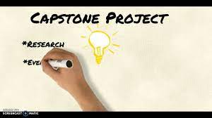

<a name="readme-top"></a>

<div align="center">
  
  
  <br/>

  <h3><b>1st Capstone Project Of Microverse (Module One)</b></h3>

</div>
<br/>

<!-- TABLE OF CONTENTS -->

# 📗 Table of Contents

- [📗 Table of Contents](#-table-of-contents)
- [📖 \[Capstone-project\] ](#-capstone-project-)
  - [🛠 Built With ](#-built-with-)
    - [Tech Stack ](#tech-stack-)
    - [Key Features ](#key-features-)
  - [🚀 Live Demo ](#-live-demo-)
  - [Loom Video ](#loom-video-)
  - [:computer: Getting Started ](#computer-getting-started-)
    - [Prerequisites](#prerequisites)
    - [Setup](#setup)
    - [Install](#install)
    - [Usage](#usage)
    - [Run tests](#run-tests)
    - [Deployment](#deployment)
    - [Prerequisites](#prerequisites-1)
    - [Setup](#setup-1)
  - [👥 Authors ](#-authors-)
  - [🔭 Future Features ](#-future-features-)
  - [🤝 Contributing ](#-contributing-)
  - [⭐️ Show your support ](#️-show-your-support-)
  - [🙏 Acknowledgments ](#-acknowledgments-)
  - [📝 License ](#-license-)

<!-- PROJECT DESCRIPTION -->

# 📖 [Capstone-project] <a name="about-project"></a>

>🔊 This website is a web development course that was inspired from a conference website CC-Global-Summit of 2015 designed by [cindy Shin](https://www.behance.net/gallery/29845175/CC-Global-Summit-2015)

**Europe-Global-Summit**

## 🛠 Built With <a name="built-with"></a>
- HTML
- CSS
- JS
- Git/GitHub
- node.js
- Boostrap 5


### Tech Stack <a name="tech-stack"></a>

- HTML
- CSS
- JS
- Git/GitHub
- node.js
- Boostrap 5

<!-- Features -->

### Key Features <a name="key-features"></a>

- **Fully Responsive**
- **Dynamic Content**

<p align="right">(<a href="#readme-top">back to top</a>)</p>

<!-- LIVE DEMO -->

## 🚀 Live Demo <a name="live-demo"></a>

- [Live Demo Link](https://michaelkith.github.io/Capstone-1-Project/)

## Loom Video <a name="loom"></a>
- [Video Link](https://www.loom.com/share/d1fb263c697a4a94a7ea60ccad611540)

<p align="right">(<a href="#readme-top">back to top</a>)</p>

<!-- GETTING STARTED -->

## :computer: Getting Started <a name="getting-started"></a>
> Describe how a new developer could make use of your project.
To get a local copy up and running, follow these steps.
### Prerequisites
In order to run this project you need a pc and install ant editor you prefer:100:
<!--
Example command:
```sh
npm install
```
 -->
### Setup
Clone this repository to your desired folder:
Example commands:
```sh
  cd Capstone-1-Project
  git clone https://github.com/MICHAELKITH/Capstone-1-Project
```
### Install
Install this project with:
<!--
Example command:
```sh
  cd Capstone-1-Project
  npm install
```
--->
### Usage
To run the project, execute the following command:
<!--
Example command:
```sh
  open live server
```
--->
### Run tests
To run tests, run the following command:
<!--
Example command:
```sh
comming soon
```
--->
### Deployment
You can deploy this project using:
<!--
Example:
```sh
netlify
```
 -->

### Prerequisites

In order to run this project you need:
- VSCode or any other IDE.
- node.js(preferable).
- browser to deploy.
- GitHub/Git.

### Setup

> Clone this repository to your desired folder:

[Git clone This Project](https://github.com/MICHAELKITH/Capstone-Project.git)

<!-- AUTHORS -->

## 👥 Authors <a name="authors"></a>

👤 **Michael Kithinji**

- GitHub: [@githubhandle](https://github.com/MICHAELKITH)
- Twitter: [@twitterhandle](https://twitter.com/DevMichael11)
- LinkedIn: [LinkedIn](linkedin.com/in/dev-mike-5a09ab167)

<p align="right">(<a href="#readme-top">back to top</a>)</p>

<!-- FUTURE FEATURES -->

## 🔭 Future Features <a name="future-features"></a>

- **Animations and Transitions to existing content**
- **Schedule Page**

<p align="right">(<a href="#readme-top">back to top</a>)</p>

<!-- CONTRIBUTING -->

## 🤝 Contributing <a name="contributing"></a>

Contributions, issues, and feature requests are welcome!

Feel free to check the [issues page](../../issues/).

<p align="right">(<a href="#readme-top">back to top</a>)</p>

<!-- SUPPORT -->

## ⭐️ Show your support <a name="support"></a>

If you like this project, you are welcomed to star and fork it. You can also share your ideas for future features. 

<p align="right">(<a href="#readme-top">back to top</a>)</p>

<!-- ACKNOWLEDGEMENTS -->

## 🙏 Acknowledgments <a name="acknowledgements"></a>

I would like to thank Cindy Shin for her original design of **Creative Commons Global Summit 2015**, as it served as an inspiration for this project.
- [Original Design](https://www.behance.net/gallery/29845175/CC-Global-Summit-2015)

<p align="right">(<a href="#readme-top">back to top</a>)</p>

<!-- LICENSE -->

## 📝 License <a name="license"></a>

This project is [MIT](./LICENSE.md) licensed.
<p align="right">(<a href="#readme-top">back to  top</a>)</p>
